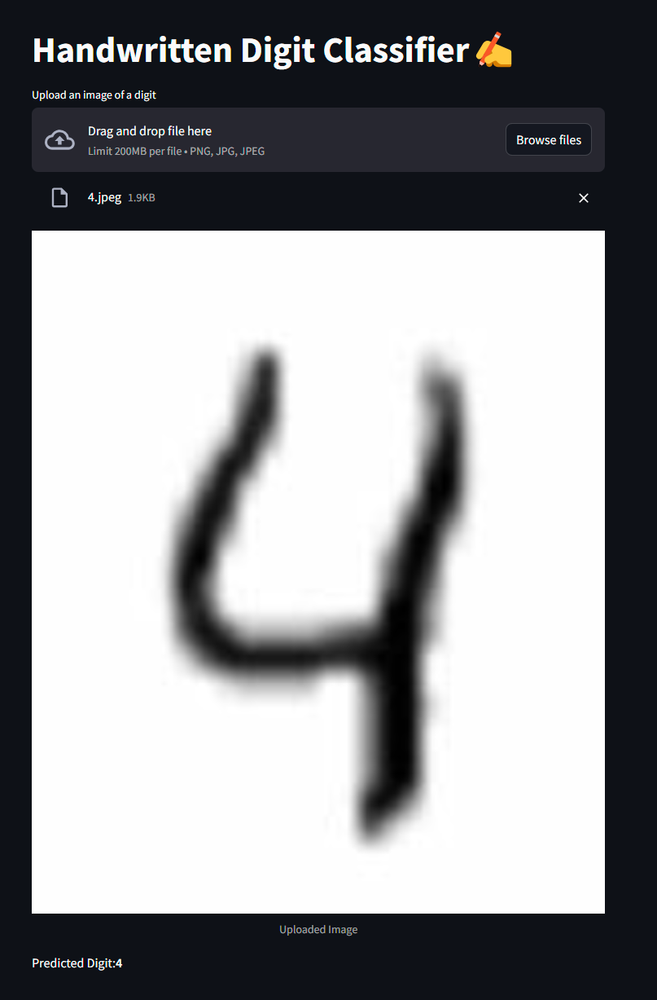

# [Image Digit Classification using Convolutional Neural Networks (CNN)](http://13.61.7.36:8501/)

## DataSet:

the link is [here](https://www.kaggle.com/competitions/digit-recognizer)

Each image is 28 pixels in height and 28 pixels in width, for a total of 784 pixels in total. Each pixel has a single pixel-value associated with it, indicating the lightness or darkness of that pixel, with higher numbers meaning darker. This pixel-value is an integer between 0 and 255, inclusive.

The training data set, (train.csv), has 785 columns. The first column, called "label", is the digit that was drawn by the user. The rest of the columns contain the pixel-values of the associated image.

## Outline:

- **Load the data set**
- **preprocessed the data**
- **Split the data**
- **What is CNN**
- **implementation with the help of keras**
